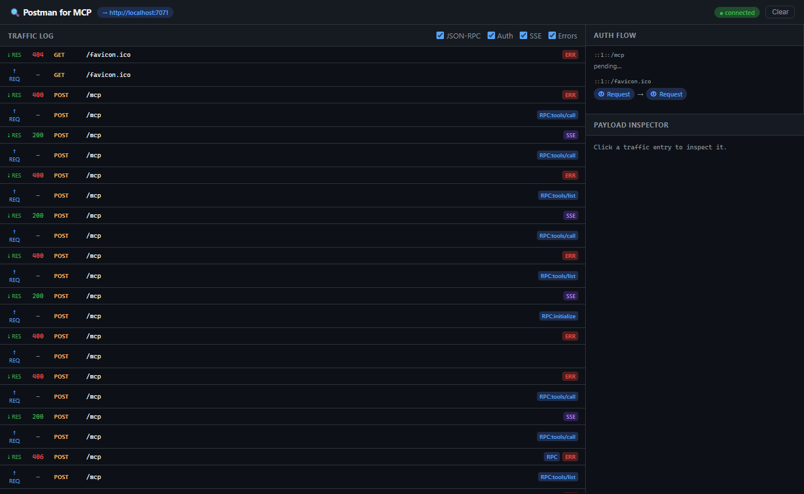

# Blueprint HUD

Blueprint HUD is an architecture-aware MCP inspector with an **Intent Workbench** that maps likely ripple effects before you change code.

It now runs as a **real VS Code side panel extension** and still includes the original local dashboard prototype.

The newest layer adds:
- a **persisted local project map**
- optional **runtime overlays** from observed traffic
- a copyable **Prompt Guardrails** block for injecting architectural constraints into AI prompts



## The Problem

When your AI agent (Copilot Chat, Claude, etc.) tries to connect to a remote MCP server hosted on Azure Functions, it goes through a complex auth flow:

```
Agent → [401 Challenge] → PRM Discovery → Token Request → Authenticated Call
```

When this breaks, you get generic errors. Blueprint HUD shows you exactly **where** it breaks.

It also adds an **Intent Workbench**: describe a change or a bug in plain English and Blueprint HUD highlights the files, runtime surfaces, risks, and execution order most likely to matter.

---

## Quick Start

### VS Code extension panel

1. Open this repo in VS Code.
2. Run:

```bash
npm install
```

3. Press `F5` and choose **Run Blueprint HUD Extension**.
4. In the Extension Development Host, click the **Blueprint HUD** icon in the activity bar.
5. Enter a change request like:

```text
Add a login requirement to the dashboard
```

The extension analyzes the **currently opened workspace** and shows likely file impact, runtime pressure, risk signals, and a suggested execution order. Click a file in the results to open it.

Blueprint HUD also keeps a local map on disk and refreshes it as files change, so repeated analyses do not start from zero every time.

### Local dashboard prototype

### 1. Install

```bash
cd mcp-blueprint-hud
npm install
```

### 2. Run (point at your Azure Function)

```bash
TARGET=https://your-function.azurewebsites.net npm start
```

Or on Windows:

```powershell
$env:TARGET = "https://your-function.azurewebsites.net"
npm start
```

### 3. Redirect your MCP client

Change your MCP client's server URL from:
```
https://your-function.azurewebsites.net
```
to:
```
http://localhost:3000
```

### 4. Open the dashboard

```
http://localhost:3000/__inspector
```

---

## What You'll See

### Traffic Log (left panel)
Every HTTP request and response your agent makes, with:
- Direction (↑ request / ↓ response)
- Status codes (green = 2xx, red = 4xx/5xx)
- Tagged by type: `RPC` for JSON-RPC calls, `401` for auth challenges, `🔑` for authenticated requests, `SSE` for streaming connections

### Auth Flow (top-right panel)
Tracks the OAuth/Entra ID handshake in real-time:
```
① Request → ② 401 ⚠ → ③ PRM → ④ Token → ⑤ Authed → ✓ Done
```

### Payload Inspector (bottom-right panel)
Click any traffic entry to see:
- Full request/response headers (Bearer tokens are partially redacted)
- JSON-RPC method calls and responses with syntax highlighting
- `WWW-Authenticate` challenge details including the Protected Resource Metadata URL
- Raw SSE event data

### Intent Workbench (right panel)
Describe a change such as:

```text
Add a login requirement to the dashboard
```

Blueprint HUD responds with:
- **High-confidence files** likely to change first
- **Runtime surfaces** to verify, like auth challenge or SSE transport paths
- **Risk signals** with explicit confidence instead of false certainty
- A **suggested execution order** so the change can be made safely
- A **Prompt Guardrails** block that can be copied into another AI workflow

### VS Code sidebar
The editor-native extension panel provides the same Intent Workbench flow directly in the activity bar:
- Analyze the **current workspace**
- Open impacted files directly from the result list
- Copy **Prompt Guardrails** into Copilot, Cursor, or another LLM workflow
- Read from a persisted **workspace map** and local runtime overlays when available
- Keep the dashboard prototype available for transport/auth debugging

## Local project map

Blueprint HUD stores non-committed analysis artifacts in:

```text
.blueprint-hud/
  graph-cache.json
  runtime-signals.json
```

- `graph-cache.json` stores the current structural map of the workspace
- `runtime-signals.json` stores recent runtime observations when the local dashboard proxy is being used

These files are local only and ignored by git.

---

## Configuration

| Environment Variable | Default | Description |
|----------------------|---------|-------------|
| `TARGET` | `https://example.azurewebsites.net` | Your Azure Function MCP server URL |
| `PORT` | `3000` | Local proxy port |

---

## Tested Against a Real Azure Functions MCP Server

We validated Blueprint HUD against [@paulyuk](https://github.com/paulyuk)'s [`node-mcp-sdk-functions-hosting`](https://github.com/paulyuk/node-mcp-sdk-functions-hosting) — a reference implementation of an MCP server hosted on Azure Functions using the Node MCP SDK as a custom handler. This is the same pattern used in Microsoft's Azure Functions MCP quickstarts.

### What we ran

```
MCP test client
      ↓  POST /mcp
Blueprint HUD  (localhost:3000)   ← dashboard at /__inspector
      ↓
Paul's Azure Functions server  (localhost:7071)
      ↓  text/event-stream (Streamable HTTP transport)
```

### How to reproduce it locally

**1. Start Paul's server**
```bash
git clone https://github.com/paulyuk/node-mcp-sdk-functions-hosting.git
cd node-mcp-sdk-functions-hosting
npm install
func start          # requires Azure Functions Core Tools v4
```
Server comes up at `http://localhost:7071/{*route}`

**2. Start Blueprint HUD pointing at it**
```powershell
cd postman-for-mcp
$env:TARGET = "http://localhost:7071"
npm start
```

**3. Open the dashboard**
```
http://localhost:3000/__inspector
```

**4. Send a real MCP call**
```powershell
$headers = @{ "Content-Type" = "application/json"; "Accept" = "application/json, text/event-stream" }

# Initialize session
Invoke-WebRequest -Uri "http://localhost:3000/mcp" -Method POST -Headers $headers `
  -Body '{"jsonrpc":"2.0","method":"initialize","params":{"protocolVersion":"2024-11-05","clientInfo":{"name":"postman-for-mcp","version":"1.0.0"},"capabilities":{}},"id":1}'

# List available tools
Invoke-WebRequest -Uri "http://localhost:3000/mcp" -Method POST -Headers $headers `
  -Body '{"jsonrpc":"2.0","method":"tools/list","params":{},"id":2}'
```

### What we observed

- Paul's server uses the **Streamable HTTP transport** — responses come back as `Content-Type: text/event-stream` with `event: message` / `data: {...}` SSE framing, even for simple JSON-RPC calls. This is the transport mode most likely to cause silent client failures.
- The server is **fully stateless** — no `mcp-session-id` header is issued; each request is self-contained.
- The `initialize` response correctly advertises `tools.listChanged: true` capability.
- `tools/list` returned two real tools: `get-alerts` (NWS weather alerts by state) and `get-forecast` (forecast by lat/lon).
- All traffic — request headers, SSE-framed JSON-RPC payloads, and response metadata — was visible in real-time in the Blueprint HUD dashboard.

The key discovery: **clients that don't include `Accept: application/json, text/event-stream`** get a clean `406 Not Acceptable` JSON-RPC error back. This is exactly the kind of subtle transport misconfiguration that Blueprint HUD makes immediately visible.

---

## Failure Gallery — What Blueprint HUD Catches

These are real failures recorded against [@paulyuk](https://github.com/paulyuk)'s Azure Functions MCP server. Each one shows up immediately in the dashboard traffic log.

### ❌ Fail 1 — Missing `Accept` header (most common mistake)

The MCP streamable HTTP transport requires the client to declare it accepts both JSON and SSE. Forget it, and the server rejects you before any MCP logic runs.

```powershell
# Wrong — Content-Type only, no Accept header
Invoke-WebRequest -Uri "http://localhost:3000/mcp" -Method POST `
  -Headers @{ "Content-Type" = "application/json" } `
  -Body '{"jsonrpc":"2.0","method":"tools/list","params":{},"id":1}'
```
```json
{ "jsonrpc": "2.0", "error": { "code": -32000,
  "message": "Not Acceptable: Client must accept both application/json and text/event-stream" }, "id": null }
```
**Fix:** Add `"Accept" = "application/json, text/event-stream"` to every request.

---

### ❌ Fail 2 — Calling a tool that doesn't exist

The server returns `isError: true` inside a 200 OK — the kind of failure that looks like success at the HTTP layer and only shows up when you inspect the payload.

```powershell
-Body '{"jsonrpc":"2.0","method":"tools/call","params":{"name":"create_issue","arguments":{"title":"test"}},"id":2}'
```
```
event: message
data: {"result":{"content":[{"type":"text","text":"MCP error -32602: Tool create_issue not found"}],"isError":true},...}
```
**Fix:** Call `tools/list` first to see what tools are actually registered.

---

### ❌ Fail 3 — Missing a required tool parameter

Calling `get-alerts` without the required `state` parameter returns a `400 Bad Request` — no JSON-RPC body, just an HTTP error.

```powershell
-Body '{"jsonrpc":"2.0","method":"tools/call","params":{"name":"get-alerts","arguments":{}},"id":3}'
```
```
HTTP 400 Bad Request
```
**Fix:** Check the tool's `inputSchema` from `tools/list` for required fields.

---

### ❌ Fail 4 — Malformed JSON body

Sending a broken JSON body returns a raw stack trace from the server's body parser — not a JSON-RPC error, which means the MCP layer never even ran.

```powershell
-Body '{this is not json'
```
```
SyntaxError: Expected property name or '}' in JSON at position 1
    at JSON.parse (<anonymous>)
    at parse (.../body-parser/lib/types/json.js:92:19)
    ...
```
**Fix:** Validate JSON before sending. The dashboard flags this as a `5xx` error entry with the full stack trace visible in the Payload Inspector.

---


Authorization header values are partially redacted in the UI (first 20 chars shown). Full tokens are never logged to disk — they're in-memory only.
